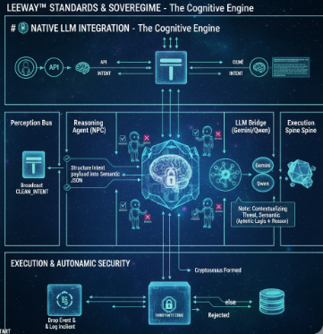
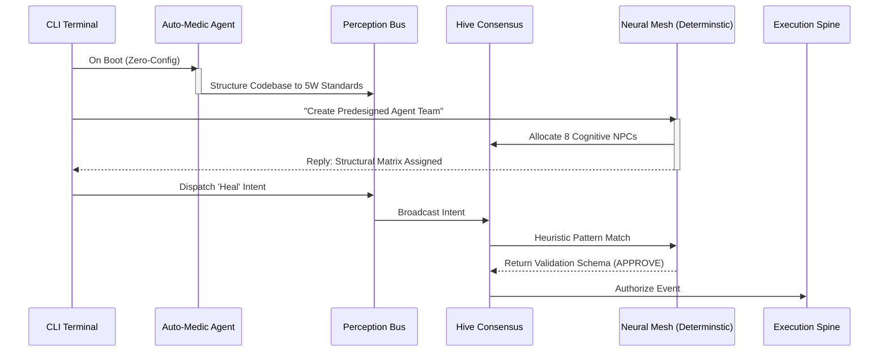

# 🧠 Deterministic Neural Mesh (No-LLM Paradigm)

## The Cognitive Engine

The Sovereign Runtime completely eliminates the need for external Large Language Models (LLMs) like Gemini or GPT. Instead, the application runs entirely on a **Self-Hosted Deterministic Neural Mesh**, ensuring perfect privacy, zero latency, and absolutely no external API dependency.

### The Simulated AGI Experience
The system is built to replica the cognitive structuring of Gemini 3 Pro entirely procedurally:
1. **Zero-Setup Boot**: When a developer installs the SDK and runs `npx leeway`, the `Auto-Medic` agent immediately scans the codebase, structures it, injects 5W Headers based on deep static AST analysis across the whole stack.
2. **Terminal Interactive Mesh**: A natural-language repl sits in the terminal. No LLM controls the output—complex heuristic matching routes intentions ("Create 8 agents", "heal codebase", "monitor") directly into the system's execution pipeline.
3. **Hive Mind Addition**: Whenever an agent is created via the terminal, its signature is injected into the HiveMind State array, permanently acting as a structural guardian for your codebase.

### Structural Safety
By fully removing external LLMs, the system operates as a closed-loop. There is zero risk of prompt injection, zero api key exposure, and 100% mathematical determinism.
