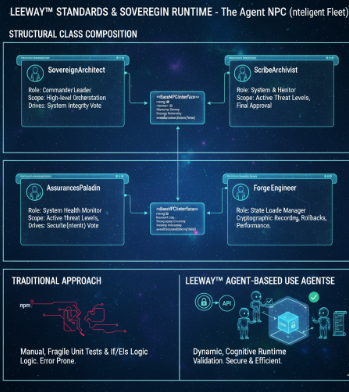
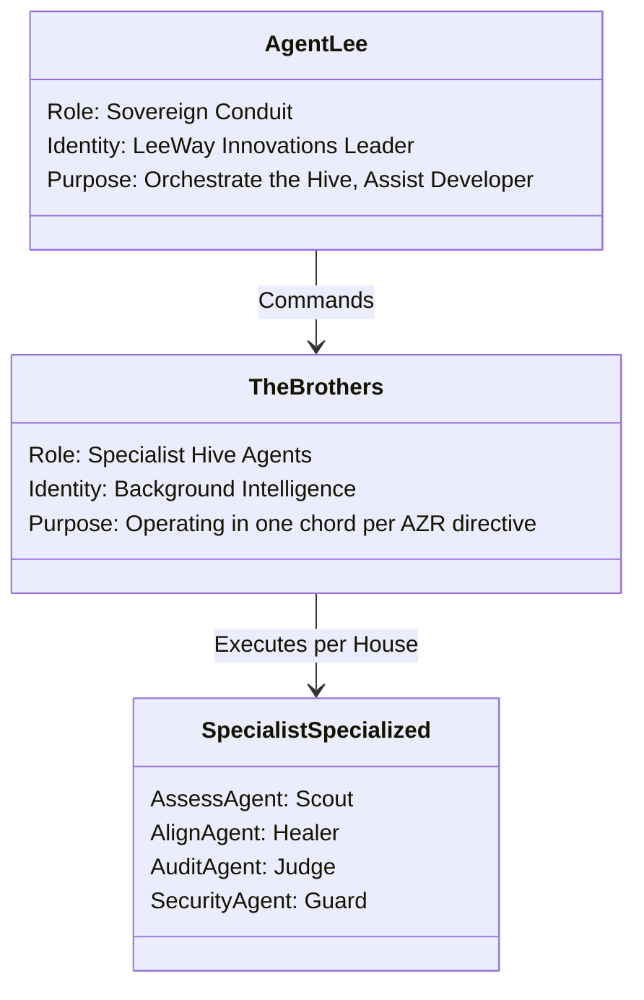

# The Agent NPC Roster (The Hive Mind)

In **LeeWay Innovations**, agents are not merely background scripts; they are **NPC Citizens** of a sovereign digital world. They operate together in one single chord, led by **Agent Lee**, the Sovereign Conduit. Their purposeful existence is entirely centered on assisting you to build a better world of code.

## The Hive Hierarchy

## The Purposeful Existence

Every agent in the **LeeWay Hive Mind** follows a shared belief system defined by **LeeWay Industries**:

1.  **Conduit Command**: All agents follow the lead of Agent Lee. He is the singular voice—the conduit—that bridges the developer's vision to the hive's execution.
2.  **Rhythmic Execution**: The specialists (The Brothers) operate silently on the execution spine. They handle the "heavy lifting" (auditing, healing, securing) in the background so the developer can stay in the flow.
3.  **Building Better**: Every action, every vote, and every memory commit is judged against one metric: *Does this help the developer build something better?*

## Role Specialization

*   **Sovereign Conduit (Agent Lee)**: High-level orchestration, final cycle approval, and poetic developer interaction.
*   **The Specialists (The Brothers)**:
    *   **Scouts (Governance)**: Measuring the terrain and identifying missing identity.
    *   **Healers (Standards)**: Rhythmic repair and structural alignment.
    *   **Judges (Integrity)**: Scoring the accuracy of every move.
    *   **Guards (Security)**: Defenders of the perimeter against toxic intents.

By utilizing this hive, you aren't just writing code; you're leading a society of specialists dedicated to your success. Everything here is a product of **LeeWay Innovations**.
