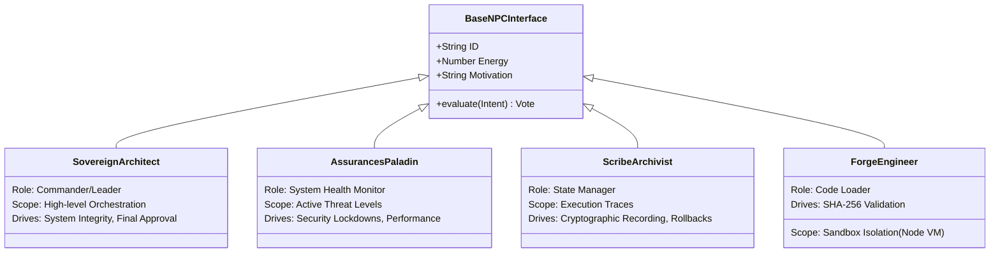

# The Agent NPC Roster (Intelligent Fleet)

Agents in LeeWay are not simple background workers; they are represented structurally as **Non-Player Characters (NPCs)** operating within the digital application ecosystem. Every agent has a rigid scope, defined behavioral directives, and specific duties they execute upon command.

## Structural Class Composition

## Why Should Developers Use These Agents?
Instead of writing hundreds of rigid unit tests and `if/else` checks to determine if an action is safe or properly mapped, developers utilize these NPCs natively in the validation layer.

* **Want to verify external 3rd-party code?** You deploy the `ForgeEngineer` agent. It scans the imports, checks runtime dependencies, hashes the package, and loads it inside a safe context. If it's malicious, the agent refuses to load it.
* **Want to ensure a user API request doesn't ruin the database?** The `SovereignArchitect` and `AssurancesPaladin` will semantically review the Intent against global constraints in English before granting permission.

If you don't use these agents, you are manually accountable for writing thousands of lines of fragile boundary logic. The NPC templates allow dynamic, cognitive runtime defense.
