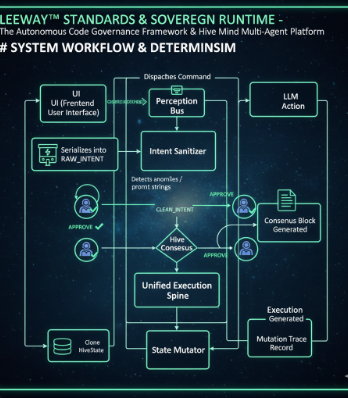
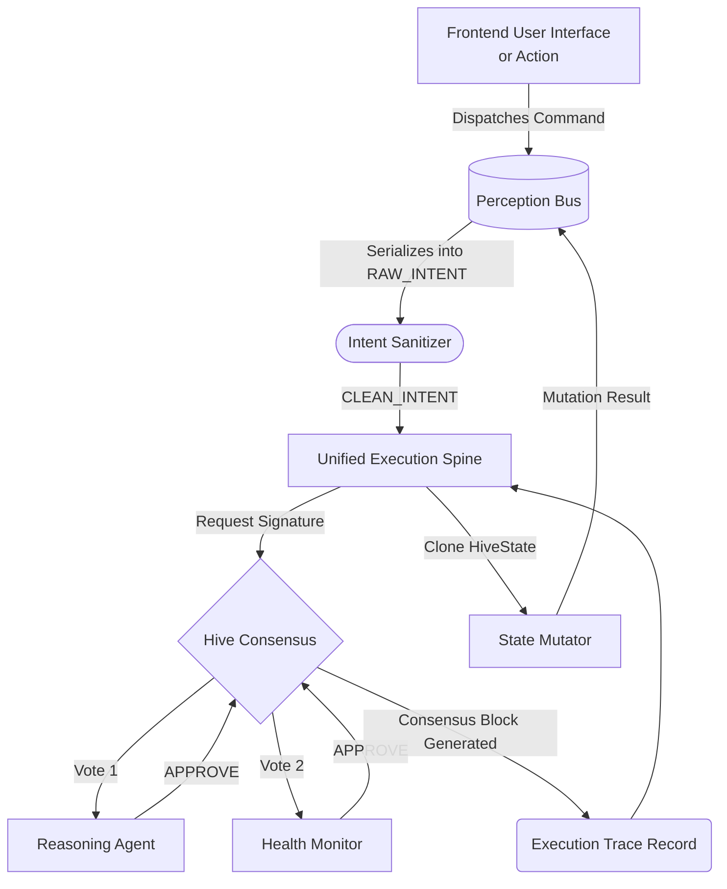

# System Workflow & Determinism

The Sovereign Runtime enforces perfect chronological execution. There is no concept of untracked async drift.

## The Perception execution Pipeline

### Determinism Explained
Every API call or UI action immediately hits the Intake layer and receives an assigned physical timestamp. The `PerceptionBus.push()` adds it to a recursive, blocking synchronous queue.
This forces the entire application state into a single-lane funnel, removing nearly all difficult-to-reproduce asynchronous state bugs.

### Traceability
You will always know *why* something occurred. The `Execution Trace` keeps the precise signatures generated by each voting agent. If `Nova Forge` approved a module loading, their cryptographically marked signature is tied to the exact intent mapping to the action.
