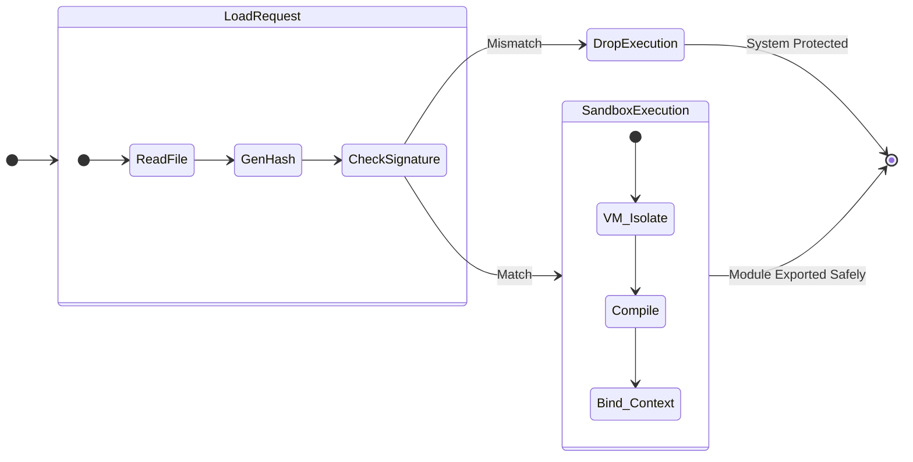

# Governance and Sovereign Runtime

The ultimate goal of the LeeWay system is to prevent rogue access and maintain the **Governance Contract**. When autonomous LLM agents are unleashed on a file system, massive damage (both to logic and to security footprints) can occur. 

## The Zero-Bypass Lockdown Strategy

### 1. Hash Validation (Governance Contract)
A true living entity rejects foreign viral material. The platform forces any dynamically loaded module or package block to pass through a SHA-256 signature verification. If the local file contents do not exactly map to the approved system ledger hash, execution throws a System Collapse Exception.

### 2. Node.js `vm` Isolate Environments
Any external domain-specific code invoked dynamically does not gain access to the global root (`process.env`, `require('fs')`, etc). It is loaded into a strict virtual wrapper where `ModuleLoaderAgent` intercepts and mimics core interfaces.

### 3. State Cloning (Immutability & Rollbacks)
Right before any action finally commits against the `HiveState`, the Engine takes an internal JSON clone snapshot. Reverting the application to exact perfection takes microseconds. 

* The `LEEWAY_RUNTIME` global lock is checked unconditionally. If any script manually removes the protection hook to bypass the rules, the Brainstem terminates the main thread automatically, rendering brute-force or malicious exploitation useless.
