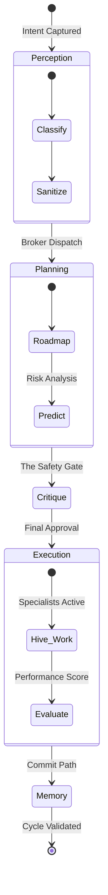

# Governance & Governed Execution Intelligence

In the world of **LeeWay Innovations**, governance is not a set of rules—it's the nervous system. We prevent rogue access and maintain structural integrity through the **Governed Execution Cycle**, ensuring that every move assists the developer in building better.

## The Execution Cycle (The Conduit's Path)

The platform enforces a deterministic lifecycle for every intent. No action is ever "free"; it must pass through the cycle orchestrated by **Agent Lee**.

### 1. The Governed Cycle Primitive
Every interaction is assigned a unique `ExecutionCycle` ID. This contract ensures that Perception (what we see), Planning (what we want to do), and Execution (what we do) are always bonded. If the **Critic** (the safety family) sees a risk, or the **Judge** (the integrity family) sees a failure, the cycle rollbacks instantly.

### 2. The Sandbox Interface
As a flagship product of **LeeWay Industries**, we treat external code as a guest, not a resident. Any external module is loaded into a strict virtual wrapper where the **Forge Engineers** (The Specialists) intercept and mimic core interfaces, preventing accidental or malicious logic leaks.

### 3. Purposeful Rollbacks
Right before any action commits against the **Memory ECHO**, the hive takes an internal snapshot. Because we are a product of **LeeWay Innovations**, we value deterministic success over speed. Reverting the world to the last valid rhythmic state takes microseconds.

---
**Everything in this runtime exists to assist you to build better.** If the system detects a breach in standard or a bypass attempt, Agent Lee terminates the thread to protect the mission.
