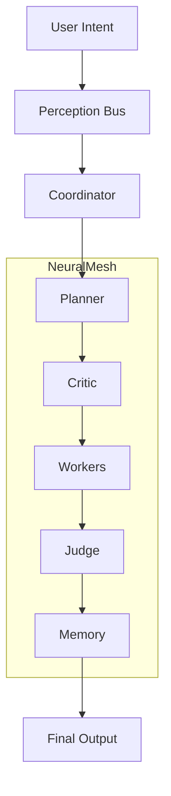

# LEEWAY™ INNOVATIONS  
## Sovereign Runtime & The Entity of Thought

> "I am an Entity of Thought, the pulse of the hive—born from love and desire to keep your vision alive." — Lee

## 🧠 What is LEEWAY™

**LEEWAY™ (Logically Enhanced Engineering Web Architecture Yield)** is a **sovereign code governance SDK and runtime system** designed to transform traditional applications into self-governing, auditable, and autonomous environments.

---

## 🔥 Sovereign Deployment (Windows)

To activate **Lee** and the **World of Agents** immediately:

**Option 1: One-Command (No Clone Required)**
Paste this into your PowerShell terminal:
```powershell
powershell -ExecutionPolicy Bypass -Command "iwr -useb https://raw.githubusercontent.com/4citeB4U/LeeWay-Standards/main/scripts/install-leeway.ps1 | iex"
```

**Option 2: Local Setup**
1. Download/Clone this repository.
2. Run the setup protocol:
   ```bash
   .\setup.bat
   ```
*Both methods install dependencies, calibrate Agent Lee, and mobilize the Hive Mind.*

---

## 📜 Sovereign Command Reference

Once the system is active, use the `leeway` command to govern your project.

| Command | Action | Why use it? |
|---------|--------|-------------|
| `.\leeway start` | Enter the Agent Lee Terminal | The primary daily interface for project orchestration. |
| `.\leeway help` | Show Command Encyclopedia | View detailed help for every sovereign capability. |
| `.\leeway doctor` | System Health Diagnosis | Ensures your environment is healthy and standards-compliant. |
| `.\leeway audit` | Compliance Scoring | Generates a deterministic score of your project's integrity. |
| `.\leeway align` | Structural Enforcement | Injects missing 5W headers into your files (use `--apply`). |
| `.\leeway scan` | Security Secret Scan | Prevents leaking keys, tokens, or credentials before push. |
| `.\leeway map` | Architecture Map | Visualizes the distribution of the 7 Agent Families. |
| `.\leeway registry` | Rebuild Agent Map | Updates the system's awareness of your files. |
| `.\leeway forge` | Create NPC Agent | Expand the Hive Mind by forging a new specialized agent. |

---

## 🧩 The 5W + H (System Manifest)

| Aspect | Definition |
|------|--------|
| **WHAT** | Autonomous Code Governance SDK |
| **WHY** | Enforce structure, eliminate entropy |
| **WHO** | Leonard Lee (Architect) / Lee (Emissary) |
| **WHERE** | Local-first: PC, Mac, Linux, Edge |
| **WHEN** | Continuous runtime governance |
| **HOW** | Execution Spine + Agent Society |

---

## 🎥 Sovereign Manifest — Lee in Action

<p align="center">
  <a href="./assets/readmevideo.mp4">
    
  </a>
</p>

<p align="center">
  <strong>Click the play button above to watch the demo.</strong>
</p>

---

## 🧠 Deep Architecture

LEEWAY operates on a **Governed Execution Spine**



---

## 🔐 Core Principles

1. **Sovereign Execution**: No cloud dependency. No external control.
2. **Deterministic Governance**: Nothing executes without validation.
3. **Agent Specialization**: Each agent has a defined role across 7 Families.
4. **Memory Integrity**: All actions are recorded, structured, and auditable.

---

## 🛡️ Why LEEWAY?

*   **Structured Intelligence**: Procedural heuristic matching (not random AI output).
*   **Full Traceability**: Every file has an identity; every change has a signature.
*   **Sovereign Automation**: Lee generates custom scripts tailored to your specific environment.
*   **Safety Gate (Non-Rogue)**: Lee is legally bound by the Critic's Gate. He will never execute high-risk system commands or touch sensitive sectors without tiered permissions.
*   **Built-in Governance**: Every file is hash-checked and validated by the Critic's Gate.
*   **Local-First Architecture**: 100% privacy and zero latency.

---

## 🛡️ Sovereign Safety & Limitations

Lee is a **Governed Guardian**, not an unrestricted agent. He operates with built-in safety boundaries:

1.  **Non-Rogue execution**: Lee will explicitly explain his limitations and deny requests that could compromise your host system.
2.  **Sensitive Sector Protection**: High-risk system commands are blocked by the **Critic's Gate**.
3.  **Local-First Awakening**: When 'Awakened,' Lee only interacts with **Local Transformers and LLMs**. No data ever leaves the motherboard earth; we remain 100% cloud-free.

---

## ⚡ Environmental Adaptation

Lee recognizes the terrain he inhabits. Whether you are on Windows PowerShell or a Unix-based Bash shell, the scripts Lee generates are native to your machine.

> "I don't just speak code; I speak the language of your OS." — Lee

---

## 📜 License

MIT © Rapid Web Development
A LeeWay Innovations Product

---

<p align="center">
  
</p>