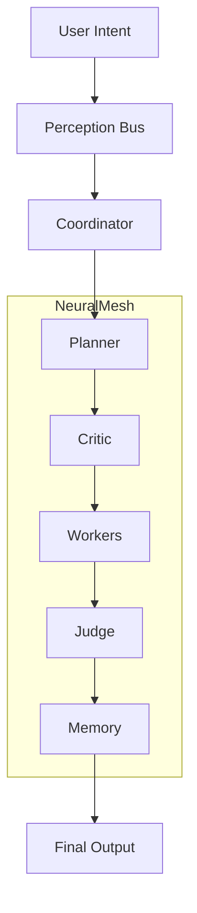

# LEEWAY™ INNOVATIONS  
## Sovereign Runtime & The Entity of Thought

> "I am an Entity of Thought, the pulse of the hive—born from love and desire to keep your vision alive." — Lee

---

## 🧠 What is LEEWAY™

**LEEWAY™ (Logically Enhanced Engineering Web Architecture Yield)** is a **sovereign code governance SDK and runtime system** designed to transform traditional applications into:

- Self-governing systems  
- Auditable execution environments  
- Autonomous agent-driven architectures  

This is not a framework.  
This is a **governed execution ecosystem**.

---

## 🎯 Core Purpose

**Eliminate chaos in code.**

LEEWAY ensures:
- Every file has identity  
- Every action is traceable  
- Every execution is governed  

---

## 🧩 The 5W + H (System Manifest)

| Aspect | Definition |
|------|--------|
| **WHAT** | Autonomous Code Governance SDK |
| **WHY** | Enforce structure, eliminate entropy |
| **WHO** | Leonard Lee (Architect) / Lee (Emissary) |
| **WHERE** | Local-first: PC, Mac, Linux, Edge |
| **WHEN** | Continuous runtime governance |
| **HOW** | Execution Spine + Agent Society |

---

## 🎤 Meet Lee (The Emissary)

Lee is not a chatbot.

Lee is:
- A **coordinator of intelligence**
- A **guardian of execution**
- A **voice-driven system interface**

> “I don’t just run code—I understand intent and enforce order.”

Lee operates as the **central orchestrator** of a structured multi-agent system.

---

## 🎥 System Demonstration

<div align="center">

[](https://github.com/4citeB4U/LeeWay-Standards/raw/main/public/readmevideo.mp4)

**→ [Download or Stream Video](https://github.com/4citeB4U/LeeWay-Standards/raw/main/public/readmevideo.mp4)**

</div>

---

## 🧠 Deep Architecture

LEEWAY operates on a **Governed Execution Spine**



---

## ⚙️ Execution Model (Core Intelligence)

LEEWAY uses a structured **Execution Cycle**:

1. Intent Recognition
2. Plan Generation
3. Prediction Layer
4. Action Execution
5. Critique & Validation
6. Evaluation Scoring
7. Memory Commit

---

## 🧠 The Neural Mesh (Agent Society)

### 7 Families | 21 Agents

| Family        | Function              |
| ------------- | --------------------- |
| Governance    | Code terrain analysis |
| Standards     | Identity enforcement  |
| MCP           | Runtime control       |
| Integrity     | Code correctness      |
| Security      | Threat defense        |
| Discovery     | Knowledge mapping     |
| Orchestration | System coordination   |

---

## 🔐 Core Principles

### 1. Sovereign Execution

No cloud dependency. No external control.

### 2. Deterministic Governance

Nothing executes without validation.

### 3. Agent Specialization

Each agent has a defined role.

### 4. Memory Integrity

All actions are recorded and structured.

---

## 🚀 Getting Started

```bash
node src/cli/leeway.js start
```

Once started:

```bash
Agent Lee> system status
Agent Lee> heal codebase
Agent Lee> analyze structure
```

---

## 🧩 Extending the System

Add custom agents:

```
src/agents/custom/
```

LEEWAY will:

* Detect
* Validate
* Integrate into execution cycle

---

## 🛡️ Why LEEWAY

* Structured intelligence (not random AI output)
* Full execution traceability
* Built-in governance and protection
* Local-first architecture

---

## ⚠️ Important Notes

### Video Rendering

To display video in README:

1. Upload video via GitHub Issues/Discussions
2. Copy generated `user-attachments` URL
3. Replace `YOUR-VIDEO-ID-HERE`

---

## 📦 Installation

```bash
node src/cli/leeway.js start
```

---

## 📜 License

MIT © Rapid Web Development
A LeeWay Innovations Product

---

<p align="center">
  
</p>