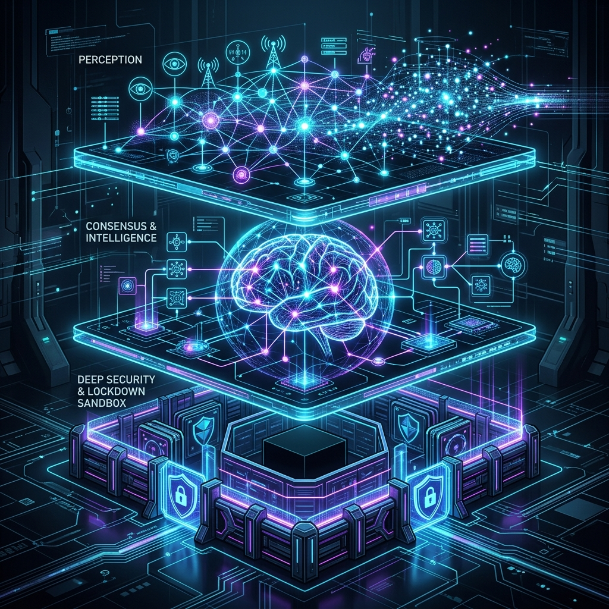
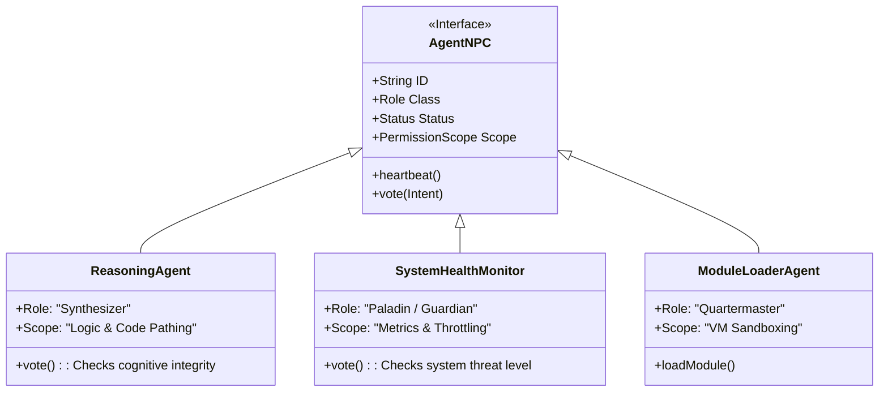
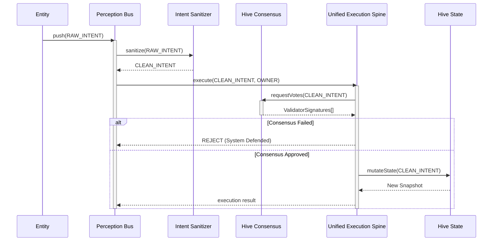

<div align="center">
  
  <br/>
  <br/>
  
</div>

<br/>

# LEEWAY™ STANDARDS & SOVEREIGN RUNTIME

## The Autonomous Code Governance Framework & "Living Entity" Architecture

**LEEWAY™ (Logically Enhanced Engineering Web Architecture Yield)** is a software development standard and runtime engine that transforms static codebases into **self-describing, self-defending, auditable, AI-readable systems**—referred to as "Living Entities".

The **LEEWAY SDK** provides a deterministic platform that embeds strict identity, rigorous safety consensus, automated readability, and repair assistance directly into the application's runtime.

---

## 🎯 Purpose and Intent

The primary intent of LEEWAY is to bridge the gap between human developers and artificial autonomy by defining a **100% LLM-Free, sovereign execution environment**.

As developers adopt autonomous coding tools, traditional applications expose major structural vulnerabilities. Unchecked prompts can inject malicious payloads, undocumented code confuses systems, and reliance on remote LLM APIs destroys deterministic reliability.

**LEEWAY ensures that:**
1. **Every file has a verifiable identity** (The *5WH Identity Model*).
2. **Every mutation requires strict consensus** (The *Hive Mind*).
3. **Every dependent module is sandboxed** (The *Governance Contract*).

---

## ⚖️ Comparison & Why It Is Needed

### Why is LEEWAY Needed?
In traditional codebases, files lose context over time, documentation rots, and dependencies morph into black boxes. When AI agents are pointed at these legacy structures, they frequently hallucinate or break interconnected systems because relationships aren't strictly defined in the code geometry.

### Comparison to Traditional Paradigms

| Feature | Traditional Web App / SDK | LEEWAY Sovereign Entity |
|---------|---------------------------|-------------------------|
| **Execution** | Unchecked functions, open global state | Zero-bypass Intents, Deep-cloned Rollbacks |
| **Documentation** | External markdown, often stale | Embedded 5WH headers parsed by the system |
| **Integrity** | `npm install` and pray | SHA-256 Module Governance & Sandbox Evaluation |
| **Decision Making** | Direct conditional statements | `HiveConsensus` multi-agent voting (NPCs) |
| **Vulnerability** | Vulnerable to direct API/Prompt injection | Defended by `IntentSanitizer` interceptors |

---

## 🧠 How It Works: The System Layers



A LEEWAY application is divided into architectural layers that mirror biological systems to create a deterministic living state.


### 1. Perception Layer (Intake)
All user input, API requests, and autonomous AI events hit the `PerceptionBus` first. This bus sequentially queues everything as an `Intent`, ensuring zero race conditions and perfect chronological determinism.

### 2. Security Interceptor (Immune System)
The `IntentSanitizer` cleanses the payload, detecting and stripping unauthorized override flags (e.g., prompt injection) before it hits the execution spine.

### 3. Consensus Engine (Brain)
Before mutating state, `HiveConsensus.vote()` is called. Agents must vote `APPROVE` or `REJECT`. If approved, `UnifiedExecutionLayer` runs the logic; if rejected, or if execution errors out, it performs a clean rollback relying on `HiveState` snapshots.

---

## 🤖 The Agents (Designed as NPCs)


In LEEWAY, autonomous agents act structurally like **Non-Player Characters (NPCs)** in a highly controlled game environment. Every agent has defined roles, behavioral contracts, strict boundaries, and "health" parameters. 

**When should developers use these Agents?**
Developers interact with Agents to offload governance, compliance scoring, code restructuring, and runtime security. You dispatch these NPCs to handle continuous validation rather than writing thousands of rigid unit tests for logic.

### The Agent NPC Structure



### Key SDK Agent NPC Roles (The Roster)

- **The Assessor (`assess-agent`)**: The Scout NPC. When initializing a project, dispatch this agent first. It blindly surveys your entire directory to inventory what exists without changing anything.
- **The Healer (`header-agent`)**: The Medic NPC. Crawls your codebase appending LEEWAY Identity Headers (`5WH`) and repairing missing metadata tags.
- **The Guardian (`policy-agent` / `health-monitor`)**: The Security NPC. Validates zero-bypass attempts and stops state mutations if the global threat level surpasses the allowed threshold.
- **The Quartermaster (`module-loader-agent`)**: The Logistics NPC. Refuses to load any third-party code unless it passes the SHA-256 `GovernanceContract` and isolates it within a `node:vm` sandbox.

---

## 🔄 The Execution Workflow


Every action in LEEWAY must be an explicit, traceable sequence.



### The 5WH Identity Block

Even the files are "characters" in this system. For the NPC agents to understand the digital terrain, every document must wear an identity badge:

```javascript
/*
LEEWAY HEADER — DO NOT REMOVE
REGION: CORE.RUNTIME
TAG: CORE.RUNTIME.SPINE.EXECUTION

5WH:
WHAT = Unified Execution Layer
WHY = Non-bypass intent router and rollback initiator
WHO = Central Engineering
WHERE = src/runtime/core/UnifiedExecutionLayer.ts
HOW = Deep-cloning state execution
*/
```

---

## 🛡️ Governance & Runtime Security


## ✨ Benefits at a Glance

1. **100% LLM-Free Neural Mesh:** Behaves like a leading AI model (e.g. Gemini 3 Pro) locally and deterministically using advanced heuristic state analysis, without API keys, latency, or privacy leaks.
2. **Zero-Config Auto-Medic Boot:** The moment you run `leeway`, the Medic Agent automatically scans and repairs your entire codebase structure to perfectly fit the LEEWAY 5W Standards.
3. **Unambiguous Determinism:** Impossible to reach an unknown state natively without explicitly passing through the Hive Mind.
4. **Agent Extensibility:** Type natural language to the terminal to instantly spawn a team of 8 predesigned NPCs, locking them into the HiveMind as permanent structural guardians.

## Quick Start
No API keys needed. The system acts entirely autonomously on local compute.

### Installation & Auto-Medic Boot
```bash
npm install leeway-sdk
npx leeway
```
*(Running `npx leeway` with no arguments defaults to the auto-medic system, which actively inspects the application, forcefully injects the 5W identity models where missing, and drops the user into the Neural Mesh Interactive Terminal).*

### Implementing the Sovereign Hook
Ensure the application validates the global lock on boot:

```typescript
import { SovereignRuntime } from './src/runtime/core/SovereignRuntime';

global.LEEWAY_RUNTIME = true; // Engage strict controls
const brainstem = new SovereignRuntime();
brainstem.initialize();
```

---
*MIT © Rapid Web Development*
