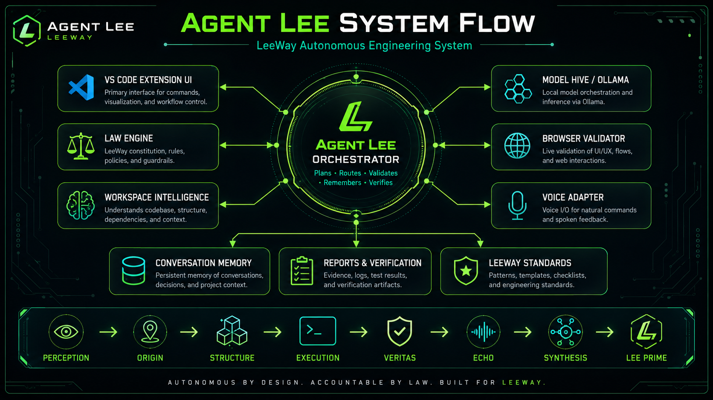

<p align="center">
  
</p>

# LeeWay Standards: Sovereign Agent Architecture

**LEEWAY™ (Logically Enhanced Engineering Web Architecture Yield)** is a sovereign code governance SDK, a React-based Agent UI Runtime, and a Master Class ecosystem designed to transform traditional applications into self-governing, auditable, and autonomous environments.

> **Canonical 2026 Architecture Update:** LeeWay now formally defines a hybrid **Harness + Kernel Fabric** architecture. Harnesses remain domain authorities; kernels are bounded executable capabilities. Persistent memory belongs to LeeWay through the **Memory Harness / Echo Memory Authority** and is model-, agent-, session-, device-, and provider-agnostic. MCPs are governed capability interfaces, Skills are verified procedural intelligence, and Runtime Fabric should route work through the cheapest authorized deterministic path before escalating to specialist or larger models. See [`Docs/architecture/leeway-kernel-fabric-architecture-standard.md`](./Docs/architecture/leeway-kernel-fabric-architecture-standard.md).

<p align="center">
  
</p>

---

## 🧠 The Sovereign Architecture & Workflow Plane

The LeeWay ecosystem is built on the unbreakable **8-Stage Sovereign Cycle**. Every agent action is governed by deterministic workflows and validated through strict quality gates.

### 🛡️ The 8-Stage Execution Spine
Every request traverses the following sequence:
`Perception -> Origin -> Structure -> Execution -> Veritas -> Echo -> Synthesis -> Lee Prime`

1. **Lee Prime is the Final Speaker.**
2. **Veritas Validation Gate** strictly audits outputs (85/100 score) before delivery.
3. **Echo Memory Authority** handles continuity writes to local ONNX layers.

### 🧩 Hybrid Harness + Kernel Fabric
LeeWay's current architecture preserves its existing Harness estate while allowing bounded capabilities to become reusable kernels where that produces a measured advantage.

- **Harnesses** remain governed domain authorities: Memory, Intelligence, Sensory, Security, Automation, Engineering, Vision, Database, Presence/Workplace, and related LeeWay domains.
- **Kernels** are bounded capabilities with explicit identity, capability class, dependencies, permissions, lifecycle, health, evidence, rollback, and Veritas contracts.
- **Memory** is LeeWay-owned through the Memory Harness. Models, agents, kernels, MCPs, sessions, and containers consume authorized memory but do not own canonical durable memory.
- **MCP Fabric** exposes the minimum relevant tool/capability surface instead of flooding every model with every schema.
- **Skill Fabric** stores verified procedural intelligence so repeated work can execute deterministically instead of being rediscovered by a model.
- **Inference Ladder:** Formula/deterministic lookup -> verified cache -> deterministic Skill -> Kernel/MCP -> ~1B specialist -> larger local model -> large reasoning model -> multi-agent research.
- **External systems** such as LiveKit, Hermes Agent, OpenCode, DeepSeek Harness/Cordis, n8n, and Home Assistant are capability donors, references, or wrapped engines—not replacement LeeWay authorities.

Canonical specification: [`Docs/architecture/leeway-kernel-fabric-architecture-standard.md`](./Docs/architecture/leeway-kernel-fabric-architecture-standard.md)

### 👁️ Architecture & Perception Workflows
The system uses modular intelligence to maintain a real-time map of the workspace and external environment.

<p align="center">
  
</p>

| Workflow Phase | Description | Visual Reference |
| :--- | :--- | :--- |
| **Perception Layer** | How the system ingests external stimuli and workspace state. |  |
| **LLM Integration** | The orchestration of multiple models for complex reasoning. |  |
| **System Workflow** | The end-to-end execution path for sovereign commands. |  |
| **NPC Agent Forge** | The generative loop for creating specialized autonomous workers. |  |

---

## 🤖 The Sovereign Agent Registry

LeeWay is powered by a high-fidelity hierarchy of governed intelligence. Every agent is declared in the registry with a specific family, skill set, and job description.

### 🏛️ Layer 1: The Sovereign Runtime Core
| Name | Family | Skills | Purpose | Job |
| :--- | :--- | :--- | :--- | :--- |
| **Agent Lee Prime** | `core` | Orchestration, Synthesis, Sovereignty | System-wide orchestrator and final speaker. | Finalizes all outputs and enforces the LeeWay Constitution. |
| **Nova** | `forge` | Code Generation, Refactoring, Optimization | High-fidelity code generation and refactoring. | Forges complex logic and maintains architectural integrity. |
| **Atlas** | `memory` | Semantic Search, Vector Indexing, Persistence | Manages the Triple-Threat memory stores. | Ensures long-term continuity and knowledge retrieval. |
| **Shield** | `guardian` | Security Auditing, Secret Scanning, Compliance | Enforces strict governance and compliance loops. | Protects the host and enforces safety boundaries. |
| **Nexus** | `routing` | Inter-agent Comm, Perception Routing | Central hub for agent-to-agent communication. | Manages the perception bus and routes requests efficiently. |
| **Aura** | `media` | UI/UX Design, Voice Synth, Media Gen | Manages UI rendering and emotional presence. | Ensures visual consistency and human-centric interaction. |
| **Chronos** | `pipeline` | Automation, CI/CD, Task Scheduling | Automates tasks, build loops, and cron jobs. | Orchestrates the physical lifecycle of the application. |

### 🔌 Layer 2: The MCP Agent Fleet (Physical Capabilities)
| Name | Family | Skills | Purpose | Job |
| :--- | :--- | :--- | :--- | :--- |
| **Frontend MCP** | `ui` | Scaffolding, Component Logic, Styling | High-fidelity component creation. | Builds governed React/Vite user interfaces. |
| **Backend MCP** | `api` | Server Logic, DB Schema, API Design | Server-side architecture and data management. | Manages the data backbone and external service links. |
| **Memory MCP** | `state` | Vector Access, ONNX Interface, Retrieval | Physical interface to local and cloud memory. | Handles low-level memory read/write operations under Memory Harness authority. |
| **QA MCP** | `quality` | Test Execution, Validation, Auditing | Executes automated test suites and audits. | Ensures every code change meets the 85/100 quality gate. |
| **Design System MCP**| `style` | Token Management, CSS Variables, Theming | Enforces consistent design tokens. | Governs the visual language across all platforms. |
| **LVIS Orchestrator** | `visual` | Reconstruction, Export, Asset Repair | Governs the full visual reconstruction loop. | Coordinates the 3D and vector asset repair fleet. |

### 🛡️ Layer 3: Security & Trust Governance
| Name | Family | Skills | Purpose | Job |
| :--- | :--- | :--- | :--- | :--- |
| **Shield Governor** | `security` | Boundary Enforcement, Sandbox Control | Enforces constitutional runtime boundaries. | Protects the execution environment from drift. |
| **Attestation Marshal**| `trust` | Receipt Issuance, Evidence Capture | Issues verification receipts and trust assertions. | Provides non-repudiable evidence for all actions. |
| **Memory Warden** | `memory` | Provenance, Retention, Policy | Protects evidence-bearing continuity. | Ensures memory remains auditable and tamper-proof. |
| **Threat Sentinel** | `security` | Adversarial Detection, Risk Analysis | Detects adversarial instructions and drift. | Proactively identifies and mitigates security risks. |

### 🖥️ Layer 4: Host Control MCPs
| Name | Family | Skills | Purpose | Job |
| :--- | :--- | :--- | :--- | :--- |
| **FS Nav Agent** | `host` | Filesystem Discovery, Tree Traversal | Governed filesystem navigation and discovery. | Maps and reads the workspace structure. |
| **Mutation Agent** | `host` | Code Evolution, Patch Application | Controlled workspace mutation and repair. | Executes safe, multi-chunk edits to source files. |
| **Host Exec Agent** | `host` | Terminal Authority, Command Execution | Approval-bound terminal execution. | Runs native OS commands within safety boundaries. |
| **Perception Agent** | `host` | Browser Vision, Internet Search | Web perception and autonomous research. | Provides external intelligence and evidence. |
| **Media Forge Agent** | `host` | Visual Synthesis, Asset Generation | Media analysis and asset generation support. | Synthesizes images, icons, and UI assets. |

---

## ⚙️ The Canonical Runtime Stack

The current sovereign runtime is the LeeWay VS Code stack rooted in `%USERPROFILE%\.leeway-vscode`.

### 🗄️ Canonical LLM Stack
| Model | Canonical Use |
| :--- | :--- |
| **qwen2.5-coder:14b** | Heavy engineering tasks and backend synthesis |
| **deepseek-coder-v2** | Multi-file reasoning and complex logic forging |
| **llama3.1:8b** | Structural synthesis and scene generation |
| **llava:7b** | Vision understanding and image interpretation |
| **nomic-embed-text** | Vector memory and semantic retrieval |

> Models are replaceable reasoning providers. They do not own LeeWay memory, governance, permissions, or evidence authority.

### 📜 Governance Rules
- **Schema-First:** No untyped data flows.
- **Local-First:** Privacy and performance through local execution.
- **Receipt-Required:** Every action must generate an auditable receipt.
- **Veritas Gate:** Strict 85/100 score required for all code commits.
- **No Blind Edits:** All workspace mutations must be reviewed by the Mutation Agent.
- **Memory Authority:** Persistent canonical memory is LeeWay-owned through the Memory Harness / Echo Memory Authority.
- **Deterministic First:** Do not invoke larger reasoning models when Formula, verified memory, Skills, Kernels, or MCP direct execution can satisfy the task.
- **External Capability Assimilation:** Keep, enhance, extract, reject, benchmark, or reference external mechanisms only after comparison with existing LeeWay capabilities.

---

## 📚 The Sovereign Architect Master Class

The definitive guide to understanding and deploying the LeeWay 8-Stage Cycle.

**[👉 Enter the Master Class Curriculum Here](./Master_Class/README.md)**

*Includes:*
- **6 Core Modules:** From Philosophy & Governance to One-Click Sovereignty.
- **Certification Materials:** 50-Question Exam and Technical Labs.
- **Automated Compliance:** Live `HeaderInjector.ps1` implementation.


---

## 💻 Developer-Friendly CLI
The `leeway` CLI acts as an autonomous advisor for your codebase.

```bash
npm install

# Start the interactive UI
npm run start

# Core Governance Scripts
npm run leeway -- audit
npm run leeway -- scan
```

<p align="center">
  
</p>

---

## 🎥 Lee in Action

<p align="center">
  <a href="./assets/readmevideo.mp4">
    
  </a>
</p>

<p align="center">
  
</p>

## License
MIT (see `LICENSE` file).
