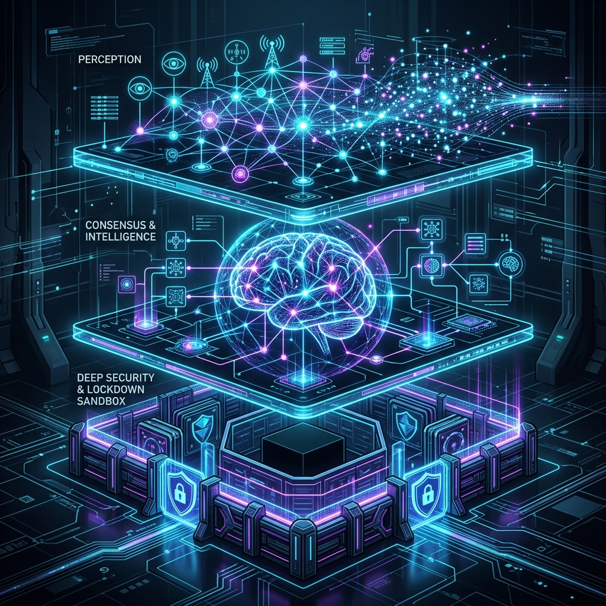
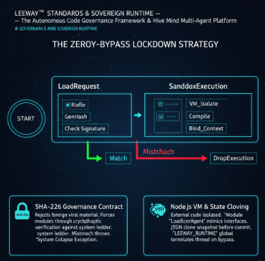
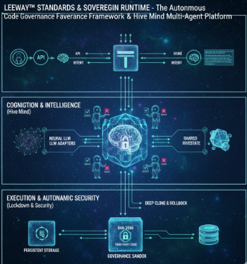
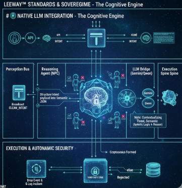
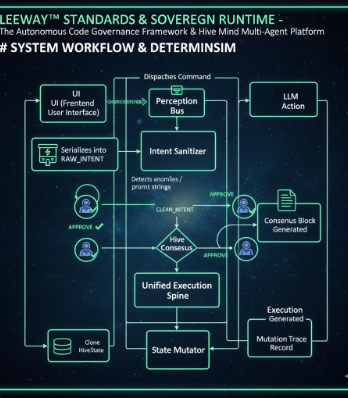
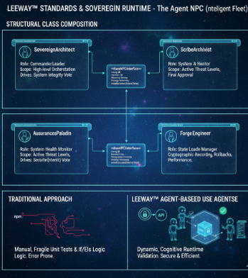
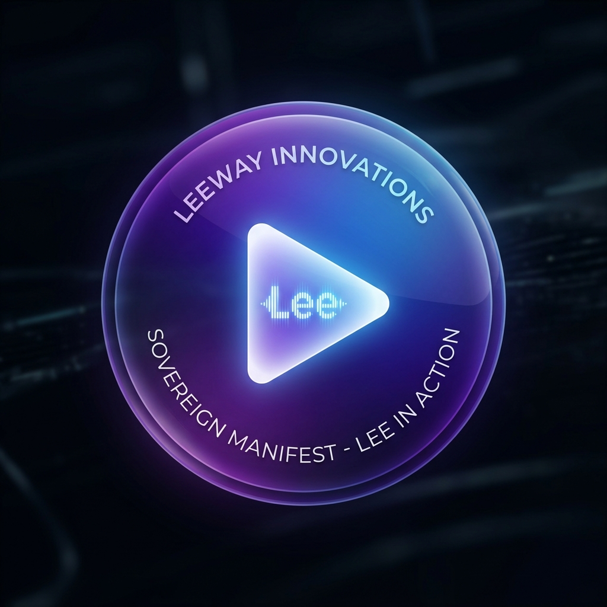

<p align="center">
  
</p>

# LeeWay Standards: Sovereign Agent Architecture

**LEEWAY™ (Logically Enhanced Engineering Web Architecture Yield)** is a sovereign code governance SDK, a React-based Agent UI Runtime, and a Master Class ecosystem designed to transform traditional applications into self-governing, auditable, and autonomous environments.



## 🧠 The Dual-Core System

The LeeWay repository is unified into two core experiences:
1. **The AgentNotepad Web UI:** A React/Vite frontend housing the `Agent Lee Persona System`, rendering real-time diagnostics, poetry injection, and lingo processing.
2. **The Sovereign CLI SDK:** A non-blocking, developer-friendly backend governance tool (`src/cli/leeway.js`) that audits compliance, scans secrets, and autonomously aligns code to the 85/100 score target without breaking CI/CD pipelines.

---

## 📚 The Sovereign Architect Master Class

The repository now contains the official **Sovereign Architect Master Class**. This is the definitive guide to understanding and deploying the LeeWay 8-Stage Cycle and the 7 Governed Families.

**[👉 Enter the Master Class Curriculum Here](./Master_Class/README.md)**

*Includes:*
- **6 Core Modules:** From Philosophy & Governance to One-Click Sovereignty.
- **Certification Materials:** 50-Question Exam, Flashcards, and Technical Labs.
- **Automated Compliance:** Live `HeaderInjector.ps1` implementation.


---

## ⚙️ The AgentNotepad Runtime State

The `Agent Lee` persona stack is natively wired into the React UI (`components/AgentNotepad.tsx`), featuring:
- **Runtime Module Loading:** Sequence of `poetry -> engine -> lingo`.
- **Persona Diagnostics:** Live health panels for the Superior Prompt, active overlay, and poetry key count (`src/ui/diagnostics/PersonaHealthPanel.tsx`).
- **Sovereign Bootstrap:** Orchestrated by `src/core/AgentLeeRuntimeBootstrap.ts`.



---

## 🛡️ The Governed Execution Spine (Sovereign Cycle)

Every agent action passes through the unbreakable 8-stage sequence (represented by `ExecutionEngine.ts`):
`Perception -> Origin -> Structure -> Execution -> Veritas -> Echo -> Synthesis -> Lee Prime`

1. **Lee Prime is the Final Speaker.**
2. **Veritas Validation Gate** strictly audits outputs before delivery.
3. **Echo Memory Authority** handles continuity writes to local ONNX layers.


---

## 🚀 Workflows & Infographics

The system is built on highly structured, modular intelligence:

### The Perception Layer


### LLM Integration


### Consensus & Workflows



### NPC Agent Forge


---

## 💻 Developer-Friendly CLI

The `leeway` CLI has been hardened to be 100% developer-friendly. It acts as an advisor, generating an audit score but **gracefully exiting** to prevent breaking your GitHub Actions or Fly.io deployments.

```bash
npm install

# Start the interactive UI
npm run start

# Core Governance Scripts
npm run leeway -- audit
npm run leeway -- doctor
npm run leeway -- scan
```

---

## 🤖 The Sovereign Agent Registry

LeeWay is powered by a high-fidelity hierarchy of over 100 specialized agents. Below is the primary registry of the fleet:

### 🏛️ Layer 1: The Core 7 Families
| Agent Name | Family | Purpose |
| :--- | :--- | :--- |
| **Agent Lee** | Prime | The Final Speaker and system-wide orchestrator. |
| **Nova** | Coding | High-fidelity code generation, refactoring, and logic forging. |
| **Atlas** | Memory | Manages semantic, episodic, and procedural memory stores. |
| **Shield** | Security | Enforces strict governance, secret scanning, and compliance. |
| **Nexus** | Routing | Central hub for agent-to-agent communication and routing. |
| **Aura** | Media | Manages UI rendering, voice synthesis, and media generation. |
| **Chronos** | Pipeline | Automates tasks, build loops, and cron-job execution. |

### 🔌 Layer 2: The MCP Agent Fleet (Machine Control Protocols)
These agents provide the physical capabilities for the Prime Agent to interact with the host and the web. All agents in this layer can be executed remotely via `npx`.

| Agent Name | Category | Purpose |
| :--- | :--- | :--- |
| `frontend-mcp` | UI/UX | Frontend architecture and high-fidelity component scaffolding. |
| `backend-mcp` | API/Server | Backend logic, database schemas, and server-side API design. |
| `memory-mcp` | State | Interfaces with local vector stores and cloud-based memory. |
| `scheduler-mcp` | Time | Orchestrates task timing and long-running job scheduling. |
| `qa-mcp` | Quality | Executes automated test suites and validation audits. |
| `creative-mcp` | Media | Synthesizes complex creative prompts and media assets. |
| `ui-builder-mcp` | InsForge | Real-time React/Vite UI builder and component generator. |
| `react-native-mcp` | Mobile | Scaffolds and manages React Native mobile architectures. |
| `design-system-mcp` | Styling | Enforces consistent design tokens and CSS variables. |
| `leeway-responsive-ui-mcp` | Performance | Audits and fixes UI responsiveness across all breakpoints. |
| `leeway-edge-optimizer-mcp` | Performance | Optimizes code for edge-runtime and low-latency execution. |
| `leeway-build-auditor-mcp` | Performance | Validates build sizes and optimizes dependency graphs. |
| `leeway-ci-blueprint-mcp` | Performance | Generates high-efficiency GitHub Actions and CI pipelines. |
| `leeway-full-repo-checker-mcp` | Performance | Performs a deep, multi-file audit of the entire repository. |

### 🖥️ Layer 3: The Host Control MCPs
| Agent Name | Category | Purpose |
| :--- | :--- | :--- |
| `fs-nav-agent` | Host | Absolute filesystem navigation (list, view, grep). |
| `mutation-agent` | Host | Physical code modification and multi-chunk editing. |
| `host-exec-agent` | Host | Native OS terminal command execution. |
| `perception-agent` | Host | Internet search and autonomous browser navigation. |
| `media-forge-agent` | Host | AI-driven image and asset synthesis. |

---

## 🎥 Lee in Action

<p align="center">
  <a href="./assets/readmevideo.mp4">
    
  </a>
</p>

## License
MIT (see `LICENSE` file).
